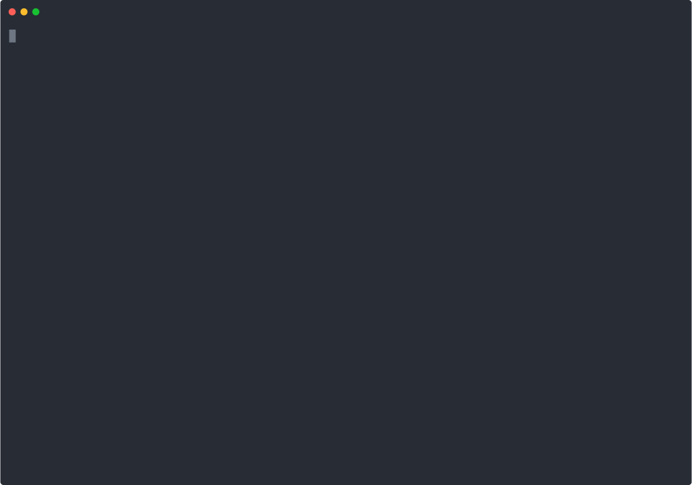

Have you ever needed to create an [EditorConfig](https://editorconfig.org/) to your programming projects but can never remember all the options you can use? Worry no more: just type `npx create-editorconfig -y` in your terminal and have one generated for you. Those are the default options:

```
# editorconfig.org
root = true

[*]
charset = utf-8
end_of_line = lf
insert_final_newline = true
indent_style = space
indent_size = 2
trim_trailing_whitespace = true
```

If you want to customize the settings or even add more for a different set of files (by defining a glob pattern), just ommit the `-y` argument in the terminal and answer the prompted questions.



## What is EditorConfig?

EditorConfig is a configuration file (the `.editorconfig`) that defines the coding styles that a given code editor (such as [VS Code](https://code.visualstudio.com/)) should apply in the files. You can even set a different set of rules for the files of your project according to your their extension or directory, by using a [glob pattern](<https://en.wikipedia.org/wiki/Glob_(programming)>).

## My code editor is not applying the EditorConfig settings

To apply your `.editorconfig` rules, your code editor should have a plugin or have EditorConfig rule parsing implemented natively (if you are using VS Code, you must install [this extension](https://marketplace.visualstudio.com/items?itemName=EditorConfig.EditorConfig).

[](https://marketplace.visualstudio.com/items?itemName=EditorConfig.EditorConfig)

## How can I contribute to `create-editorconfig`?

Please, go to the official [GitHub repository](https://github.com/douglasdeMoura/create-editorconfig) and open an issue.

##
