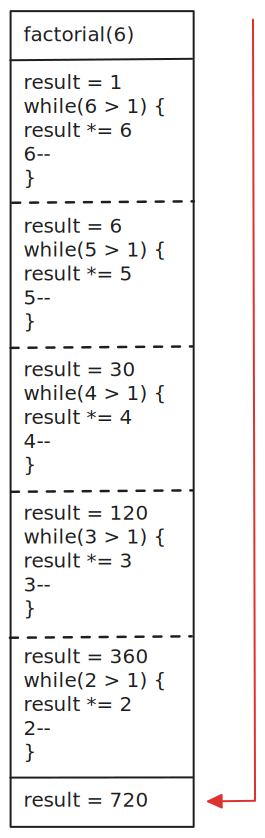
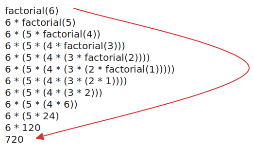
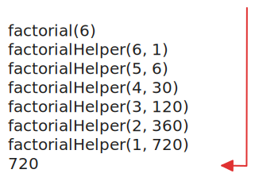

Considere a seguinte função que calcula o fatorial de um número:

```javascript
const factorial = (n) => {
  let result = 1;

  while (n > 1) {
    result *= n;
    n--;
  }

  return result;
};
```

<aside data-alert data-color="blue" role="note">
<strong>Fatorial</strong>
Em matemática, o fatorial de um inteiro n não negativo (n!), é o produto de todos os inteiros positivos menores ou iguais a n.
</aside>

A função acima foi implementada de forma iterativa, ou seja, ela utiliza um laço de repetição para calcular o fatorial de um número. Porém, é possível implementar a mesma função de forma recursiva (ou seja: uma função que referencia a si mesma):

```javascript
const factorial = (n) => {
  if (n === 0) return 1;

  return n * factorial(n - 1);
};
```

O resultado de ambas às funções é o mesmo, porém, a função iterativa é [muito mais eficiente](https://jsben.ch/1qyl8) (no JavaScript) que a função recursiva. Além disso, se tentarmos calcular o fatorial de um número muito grande, nós deparamos com o erro RangeError: Maximum call stack size exceeded. Vamos entender o porquê disso e como podemos melhorar a função recursiva.

## Pilha de execução

Uma [pilha de execução (call stack)](https://developer.mozilla.org/en-US/docs/Glossary/Call_stack) é uma estrutura de dados que armazena informações sobre as funções de um programa. Quando uma função é chamada, ela é adicionada à pilha de execução, assim como todas as funções que ela chamar. Quando uma função retorna, ela é removida da pilha de execução. Cada função adicionada à pilha é chamada de _stack frame_.

Para entendermos o que está acontecendo, vamos tentar representar, graficamente, como o cálculo do fatorial de 6 é feito com a função iterativa:



Agora, compare com o modelo de substituição para o cálculo do fatorial de 6 com a função recursiva:



Observe, que, na função iterativa, a forma da seta é linear e podemos ver o estado de cada variável em cada passo. Além disso, a cada iteração do nosso laço de repetição, um cálculo e efetuado e as variáveis armazenadas na memória são atualizadas. Na função recursiva, a forma da seta é exponencial e não podemos ver o estado de todas as variáveis na primeira metade do processamento. Além disso, a cada vez que a função é executada, mais memória precisa ser utilizada para armazenar os valores resultantes de cada execução.

Mas, o que isso significa? Para que o JavaScript possa calcular o fatorial de 6, com a função iterativa, a condição `while` é adicionada à pilha, onde seu cálculo é efetuado, a variável result é atualizada e, em seguida, o bloco de código executado do `while` é retirado da pilha. Isso é feito até que a condição while seja falsa, ou seja, até que o valor de `n` seja menor ou igual a 1.

Já, na função recursiva, cada chamada da função `factorial` é adicionada à pilha quantas vezes forem necessárias até que a condição if seja falsa, ou seja, até que o valor de `n` seja menor ou igual a 1. Isso significa que, para calcular o fatorial de 6, a função factorial é adicionada à pilha 6 vezes, para, então ser executada. E é por isso que, quando tentamos calcular o fatorial de um número grande (100.000, por exemplo), nos deparamos com o erro `RangeError: Maximum call stack size exceeded`: não há espaço suficiente na pilha para armazenar todas as chamadas da função factorial.

## Introduzindo Tail Call Optimization

Como bem definido pelo [Dr. Axel Rauschmayer](https://dr-axel.de/) (grifo meu):

> [...] sempre que a última coisa que uma função faz é chamar outra função, então esta última não precisa retornar para sua chamadora. Como consequência, nenhuma informação precisa ser armazenada na pilha de chamadas e a chamada de função é mais como um goto (um salto). Esse tipo de chamada é chamado de _tail call_; não aumentar a pilha é chamado de tail call optmization (TCO).

Ora, descobrimos que nossa função para calcular fatorial não é _tail recursive_. Mas, como podemos torná-la tail recursiva? Com a ajuda de outra função:

```javascript
const factorial = (n) => {
  return factorialHelper(n, 1);
};

const factorialHelper = (x, accumulator) => {
  if (x <= 1) {
    return accumulator;
  }

  return factorialHelper(x - 1, x * accumulator);
};
```

Agora, sim, nossa função é _tail recursive_: a última coisa que ela faz é chamar uma função (e não calcular uma expressão, como na primeira implementação).Agora, vamos ver o modelo de substituição para o cálculo do fatorial de 6 com a nossa nova função `factorial`:



[O desempenho é superior](https://jsben.ch/vOf9P) ao da nossa primeira implementação, apesar de ainda não bater o desempenho da função iterativa. Porém, ainda nos deparamos com o erro `RangeError: Maximum call stack size exceeded`. Mas, por que isso acontece? Porque, apesar de nossa função ser _tail recursive_, as atuais versões do Node.js e os navegadores ([com exceção do Safari](https://webkit.org/blog/6240/ecmascript-6-proper-tail-calls-in-webkit/)) não implementa Tail Call Optimization (apesar de sua inclusão na especificação do [EcmaScript](https://262.ecma-international.org/6.0/#sec-tail-position-calls) desde 2015).

Mas, como resolveremos este problema? Com a ajuda de outra função, claro! Para isso, vamos contar com a ajuda do padrão [Trampoline](<https://en.wikipedia.org/wiki/Trampoline_(computing)>):

```javascript
const trampoline = (fn) => {
  while (typeof fn === "function") {
    fn = fn();
  }

  return result;
};
```

Nossas função trampoline consiste em um laço de repetição que invoca uma função que envolve outra função (o que chamamos de [thunk](https://en.wikipedia.org/wiki/Thunk)) até que não haja mais funções para executar. Vamos ver como ficaria a implementação da nossa função factorial com o padrão Trampoline:

```javascript
const trampoline = (fn) => {
  while (typeof fn === "function") {
    fn = fn();
  }

  return fn;
};

const factorialHelper = (x, accumulator) => {
  if (x <= 1) {
    return accumulator;
  }

  // Note que, agora, a função retorna uma função
  return () => factorialHelper(x - 1, x * accumulator);
};

const factorial = (n) => {
  return trampoline(factorialHelper(n, 1));
};
```

E agora sim, podemos chamar a nossa função factorial com um número grande, sem nos depararmos com o erro RangeError: Maximum call stack size exceeded. Claro, dependendo do fatorial que quisermos calcular, nos depararemos com um Infinity, por se tratar de um número muito grande (um número maior que o Number.MAX_SAFE_INTEGER: 253 - <sup>1</sup>). Neste caso, podemos usar o [BigInt](https://developer.mozilla.org/en-US/docs/Web/JavaScript/Reference/Global_Objects/BigInt):

```javascript
const trampoline = (fn) => {
  while (typeof fn === "function") {
    fn = fn();
  }

  return fn;
};

const factorialHelper = (x, accumulator) => {
  if (x <= 1) {
    return accumulator;
  }

  return () => factorialHelper(x - 1n, x * accumulator);
};

const factorial = (n) => {
  // Convertendo os valores para BigInt
  //-------------------------------\/----------\/
  return trampoline(factorialHelper(BigInt(n), 1n));
};
```

## Tipando a nossa função

E, para finalizar, vamos adicionar os tipos necessários para a nossa função factorial:

```typescript
type Thunk = bigint | (() => Thunk);

const trampoline = (fn: Thunk) => {
  while (typeof fn === "function") {
    fn = fn();
  }

  return fn;
};

const factorialHelper = (x: bigint, accumulator: bigint): Thunk => {
  if (x <= 1) {
    return accumulator;
  }

  return () => factorialHelper(x - 1n, x * accumulator);
};

const factorial = (n: number) => {
  return trampoline(factorialHelper(BigInt(n), 1n));
};
```

## Referências

- [What happened to proper tail calls in JavaScript?](https://www.mgmarlow.com/words/2021-03-27-proper-tail-calls-js/)
- [Tail Call Optmization](https://exploringjs.com/es6/ch_tail-calls.html)
- [Limites da recursão em JavaScript, TCO e o pattern Trampoline](http://cangaceirojavascript.com.br/limites-recursao-javascript-tco-e-pattern-trampoline/)
- [What is an Activation object in JavaScript?](https://softwareengineering.stackexchange.com/a/189973/383960)
- [Factorial](https://mathworld.wolfram.com/Factorial.html)
- [Tail Recursion Explained - Computerphile](https://www.youtube.com/watch?v=_JtPhF8MshA)
- [Tail Call Optimization: The Musical!!](https://www.youtube.com/watch?v=-PX0BV9hGZY)
