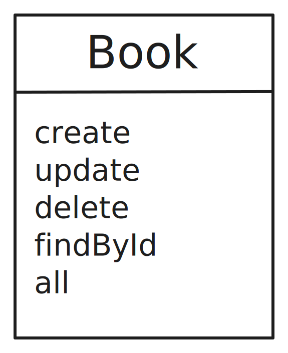

No livro [_A Pattern Language_](https://en.wikipedia.org/wiki/A_Pattern_Language), Christopher Alexander e seus colegas definem um padrão como:

> Cada padrão descreve um problema que ocorre repetidamente em nosso ambiente e, em seguida, descreve o núcleo da solução para esse problema, de tal forma que você pode usar essa solução um milhão de vezes, sem nunca fazê-lo da mesma maneira duas vezes.

<div hidden>
Each pattern describes a problem which occurs over and over again in our environment, and then describes the core of the solution to that problem, in such a way that you can use this solution a million times over, without ever doing it the same way twice
</div>

Cristopher e os outros autores estavam se referindo a padrões de arquitetura de construção, mas, desde muito tempo, a disciplina de engenharia de software adotou este mesmo conceito para o desenvolvimento de software, que foi cristalizado pelo famoso livro [_Design Patterns: Elements of Reusable Object-Oriented Software_](https://engsoftmoderna.info/cap6.html#padr%C3%B5es-de-projeto) de Erich Gamma, Richard Helm, Ralph Johnson e John Vlissides (conhecidos como _Gang of Four_ ou _GoF_). No livro, eles definem padrões de projeto como:

> Padrões de projeto descrevem objetos e classes que se relacionam para resolver um problema de projeto genérico em um contexto particular.

É preciso entender que os padrões de projeto descritos nestes livros não são soluções que **devem** ser aplicadas em toda e qualquer situação, mas sim, descrições gerais de soluções para problemas comuns de projetos de software. Desse modo, as soluções propostas podem ser entendidas como um catálogo, a partir do qual pode-se estabelecer um vocabulário comum entre todas as pessoas envolvidas no desenvolvimento de um software, facilitando a comunicação e a compreensão do código.

Para ilustrar o que foi dito até aqui, vamos considerar um exemplo. Suponha que você está construindo um sistema de gerenciamento de uma biblioteca pessoal e, no seu banco de dados relacional, há uma tabela para armazenar os dados de um livro. A tabela pode ser criada com o seguinte comando SQL, em um banco de dados SQLite:

```sql
-- SQLite
CREATE TABLE
  `books` (
    `id` INTEGER NOT NULL PRIMARY KEY autoincrement,
    `author` TEXT NOT NULL,
    `title` TEXT NOT NULL,
    `isbn` TEXT NOT NULL,
    `updated_at` DATETIME NULL,
    `created_at` DATETIME NOT NULL DEFAULT CURRENT_TIMESTAMP
  );
```

Vamos escolher o padrão [_Active Record_](https://www.martinfowler.com/eaaCatalog/activeRecord.html) para representar os dados de um livro no nosso sistema. Para isso, vamos criar uma classe em JavaScript conforme o diagrama abaixo:



E este é o código:

```javascript
import { AsyncDatabase } from "promised-sqlite3";

const db = await AsyncDatabase.open(
  // caminho para o arquivo do banco de dados SQLite
  process.env.DATABASE_URL
);

export class ActiveRecord {
  constructor({ database = db, tableName }) {
    this.database = database;
    this.tableName = tableName;
  }

  all(columns = "*") {
    const cols = Array.isArray(columns) ? columns.join(", ") : columns;

    return this.database.all(`SELECT ${cols} FROM ${this.tableName}`);
  }

  async findById(id, columns = "*") {
    const cols = Array.isArray(columns) ? columns.join(", ") : columns;
    const statement = await this.database.prepare(
      `SELECT ${cols} FROM ${this.tableName} WHERE id = $id`,
      { $id: id }
    );

    return statement.get();
  }

  async create(data) {
    const columns = Object.keys(data);
    const values = Object.values(data);
    const statement = await this.database.prepare(
      `INSERT INTO ${this.tableName} (${columns.join(", ")}) VALUES (${columns.map(() => "?").join(", ")})`,
      values
    );

    return statement.run();
  }

  async update(id, data) {
    const columns = Object.keys(data);
    const values = Object.values(data);
    const statement = await this.database.prepare(
      `UPDATE ${this.tableName} SET ${columns.map((column) => `${column} = ?`).join(", ")} WHERE id = $id`,
      [...values, id]
    );

    return statement.run();
  }

  async delete(id) {
    const statement = await this.database.prepare(
      `DELETE FROM ${this.tableName} WHERE id = $id`,
      { $id: id }
    );

    return statement.run();
  }
}

export class Book extends ActiveRecord {
  constructor() {
    super({ tableName: "books" });
  }
}
```

<Alert title="Atenção" mb="md" color="yellow">
A implementação acima é apenas um exemplo didático. Não há preocupações com segurança ou validação de dados antes de inseri-los ou atualizar os dados no banco de dados.
</Alert>

Note que todo o SQL necessário para manipular os dados no nosso banco SQLite está encapsulado na classe `ActiveRecord`. Além disso, a classe `Book` herda todos os métodos da classe `ActiveRecord` e, portanto, não é necessário escrever o mesmo código para cada tabela do banco de dados. Desse modo, é possível criar várias entidades distintas no nosso sistema, como `Author`, `Publisher`, `Category`, `BookCategory`, `BookAuthor`, `BookPublisher`, etc. Todas elas herdam os métodos da classe `ActiveRecord` e, portanto, não é necessário escrever o mesmo código para cada tabela do banco de dados.

Mais que isso, podemos reimplementar os métodos da classe pai na classe filha, caso haja algum requisito especial para alguma entidade, como transformar o `delete` em um _soft delete_. Por exemplo:

```javascript
export class Book extends ActiveRecord {
  constructor() {
    super({ tableName: "books" });
  }

  async delete(id) {
    const statement = await this.database.prepare(
      // Não se esqueça de adicionar a coluna `deleted` na tabela `books`
      `UPDATE ${this.tableName} SET deleted = true WHERE id = $id`,
      { $id: id }
    );

    return statement.run();
  }
}
```

Este padrão pode resolver o nosso caso de uso, porém, como próprio Martin Fowler alerta, este padrão pode não ser o mais adequado para se aplicar em uma entidade que precisa se relacionar com um repositório (ou repositórios) de dados mais complexos (apesar de que Ruby on Rails [utiliza este padrão](https://guides.rubyonrails.org/active_record_basics.html) extensamente).

Se tiver alguma dúvida, comentário ou sugestão, deixe um comentário abaixo ou entre em contato comigo pelo [Twitter](https://twitter.com/douglasdemoura).

## Referências

- [Padrões de Projeto](https://engsoftmoderna.info/cap6.html#padr%C3%B5es-de-projeto)
- [Design patterns: elements of reusable object-oriented software](https://dl.acm.org/doi/book/10.5555/186897)
- [Patterns of Enterprise Application Architecture, by Martin Fowler](https://martinfowler.com/books/eaa.html)
