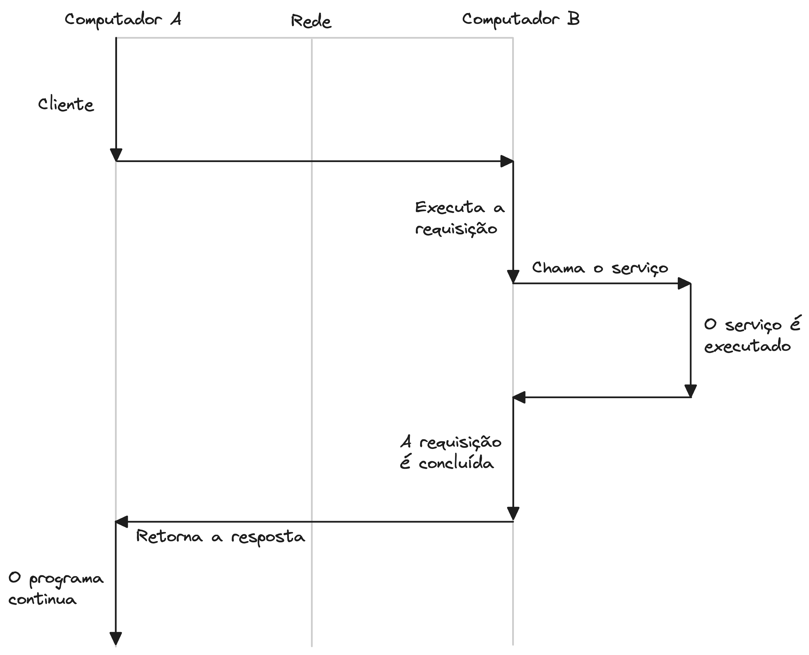
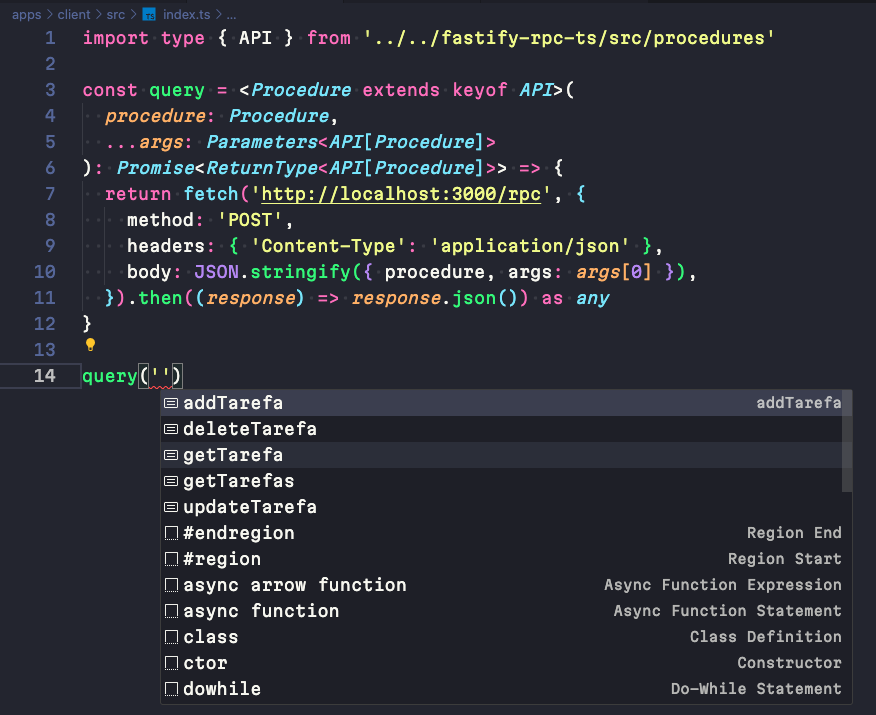
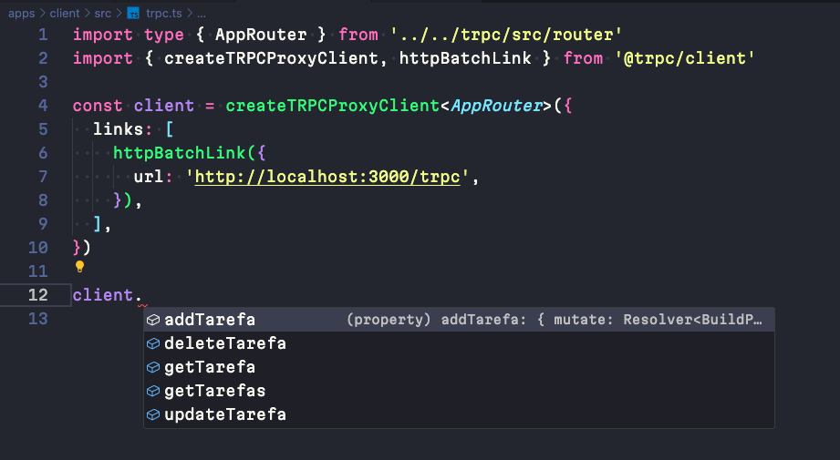

O desenvolvimento de <abbr title="Application Programming Interface">API</abbr>s consiste em boa parte do trabalho feito por profissionais de tecnologia (pelo menos daqueles que trabalham com a web) e, ao longo do tempo, surgiram diversos padrões para ajudar a lidar com a complexidade de se desenvolver tais APIs, como <abbr title="Representational State Transfer Application Programming Interface">REST</abbr>, GraphQL e o <abbr title="Remote Procedure Call">RPC</abbr>. Neste artigo, irei tratar do último, usando o [tRPC](https://trpc.io/).

## Mas o que é <abbr title="Remote Procedure Call">RPC</abbr>?

RPC (*Remote Procedure Call* - em português: chamada de função remota) é um mecanismo de comunicação entre dois computadores, onde um pode ser identificado como *cliente* e o outro por ser identificado como *servidor*. Do ponto de vista do cliente, chamar uma RPC é apenas uma questão de chamar uma função com seus devidos argumentos e aguardar uma resposta, a fim de continuar a execução do programa.



E por que alguém faria isso? Ora, para distribuir seu sistema em servidores distintos, no momento que essa distribuição fizer sentido para o desenvolvimento do sistema.

## Criando uma API com JavaScript e o padrão RPC

Agora que já sabemos o que é RPC, vamos criar uma API simples que tira proveito deste padrão, usando o [Fastify](https://fastify.dev/)). Desse modo poderemos entender melhor o padrão RPC com um exemplo prático e, de quebra, entender como o tRPC funciona.

Vamos criar uma API que irá criar, ler, atualizar e excluir itens em uma lista de tarefa. Vamos começar com o código básico do nosso servidor. Atente-se aos comentários do código abaixo:

```javascript [server/src/index.js]
import Fastify from "fastify";

// Neste arquivo, definiremos todas as procedures disponíveis
// na nossa API.
import * as procedures from "./procedures.js";

const fastify = Fastify();

// Nossa API terá um único endpoint: /rpc e
// só aceita requisições do tipo POST.
fastify.post("/rpc", async (req, res) => {
  // Toda requisição para /rpc deverá informar
  // qual procedure deseja chamar no corpo da requisição.
  if (!req.body?.procedure) {
    res.status(400).send({
      title: "Faltam parâmetros obrigatórios",
      details: 'O parâmetro "procedure" é obrigatório.',
    });
  }

  const procedure = procedures[req.body.procedure];

  // Se a procedure não estiver definida, retorna um erro
  if (!procedure || typeof procedure !== "function") {
    return res.status(404).send({
      title: "Procedure não encontrada",
      details: `A procedure ${req.body.procedure} não foi encontrada.`,
    });
  }

  try {
    // Chama a procedure com os argumentos, também
    // passados no corpo da requisição
    const response = procedure?.(req.body.args);

    // Eu espero que toda procedure retorne um objeto
    // com _status_ e _data_.
    return res.status(response?.status || 200).send(response?.data);
  } catch (error) {
    return res.status(error?.code || 500).send({
      title: error?.title || "Erro",
      details: error?.message || "Ocorreu um erro.",
    });
  }
});

// Inicia o servidor
try {
  await fastify.listen({ port: 3000 });
} catch (err) {
  fastify.log.error(err);
  process.exit(1);
}
```

Adicionamos as nossas *procedures*:

```javascript [server/src/procedures.js]
// Criamos um classe de erro personalizada
// só para as nossas procedures.
class ProcedureError extends Error {
  constructor(message, code, title) {
    super(message);
    this.title = title;
    this.code = code;
  }
}

// "Banco de dados"
export let tarefas = [
  {
    id: 1,
    title: "Tarefa 1",
  },
  {
    id: 2,
    title: "Tarefa 2",
  },
  {
    id: 3,
    title: "Tarefa 3",
  },
];

// Funções de CRUD

export const getTarefas = () => {
  return {
    status: 200,
    data: tarefas,
  };
};

export const getTarefa = (id) => {
  if (!id) {
    throw new ProcedureError(
      "O id é obrigatório",
      400,
      "Faltam parâmetros obrigatórios"
    );
  }

  const tarefa = tarefas.find((todo) => todo.id === id);

  if (!tarefa) {
    throw new ProcedureError(`Tarefa ${id} não encontrada`, 404);
  }

  return {
    status: 200,
    data: tarefa,
  };
};

export const addTarefa = (title) => {
  if (!title) {
    throw new ProcedureError(
      "O título é obrigatório",
      400,
      "Faltam parâmetros obrigatórios"
    );
  }

  const id = tarefas.length + 1;
  const tarefa = {
    id,
    title,
  };

  tarefas.push(tarefa);

  return {
    status: 201,
    data: { id },
  };
};

export const updateTarefa = ({ id, title }) => {
  if (!id || !title) {
    throw new ProcedureError(
      "O id e o título são obrigatórios",
      400,
      "Faltam parâmetros obrigatórios"
    );
  }

  const index = tarefas.findIndex((todo) => todo.id === id);

  if (index === -1) {
    throw new ProcedureError(`Tarefa ${id} não encontrada`, 404);
  }

  tarefas[index].title = title;

  return {
    status: 200,
  };
};

export const deleteTarefa = (id) => {
  if (!id) {
    throw new ProcedureError(
      "O id é obrigatório",
      400,
      "Faltam parâmetros obrigatórios"
    );
  }

  const index = tarefas.findIndex((todo) => todo.id === id);

  if (index === -1) {
    throw new ProcedureError(`Tarefa ${id} não encontrada`, 404);
  }

  tarefas = tarefas.filter((todo) => todo.id !== id);

  return {
    status: 204,
  };
};
```

Vamos iniciar a nossa API com `node src/index.js` e testar a chamada às nossas procedures. Vou usar o [`curl`](url) neste exemplo pois já que estamos usando um emulador de terminal, mas fique a vontade para usar a ferramenta que preferir. Ah, não se esqueça que todas as nossas requisições são do tipo `POST`:

```bash
curl --json '{"procedure": "getTarefas"}' http://localhost:3000/rpc

curl --json '{"procedure": "getTarefa", "args": 1}' http://localhost:3000/rpc

curl --json '{"procedure": "updateTarefa", "args": {"id": 1, "title": "Novo título"}}' http://localhost:3000/rpc

curl --json '{"procedure": "addTarefa", "args": "Nova tarefa"}' http://localhost:3000/rpc

curl --json '{"procedure": "deleteTarefa", "args": 4}' http://localhost:3000/rpc
```

## Adicionando TypeScript

Como queremos uma API cujos tipos possam ser compartilhados do servidor para o cliente, vamos converter o nosso código JavaScript para TypeScript, da seguinte forma (e adicionar algumas melhorias ao mesmo tempo):

```typescript [server/src/errors.ts]
// Vamos separar a nossa classe ProcedureError
// em seu próprio arquivo:

export class ProcedureError extends Error {
  code: number;
  title: string | undefined;

  constructor(message: string, code: number, title?: string) {
    super(message);
    this.title = title;
    this.code = code;
  }
}
```

Agora, criamos o arquivo `app.ts` para colocar o código de configuração do servidor, excluindo a parte que inicia o servidor. Novamente, leia os comentários com atenção:

```typescript [server/src/app.ts]
import Fastify from "fastify";
import * as procedures from "./procedures";
import { ProcedureError } from "./errors";

export const app = () => {
  const fastify = Fastify();

  // Adiciona os tipos esperados no Body da requisição.
  fastify.post<{
    Body: {
      procedure: string;
      args?: any;
    };
  }>("/rpc", async (req, res) => {
    if (!req.body?.procedure) {
      res.status(400).send({
        title: "Faltam parâmetros obrigatórios",
        details: 'O parâmetro "procedure" é obrigatório.',
      });
    }

    // Fazemos coerção do tipo das procedures.
    const procedure =
      procedures?.[req.body?.procedure as keyof typeof procedures];

    if (!procedure || typeof procedure !== "function") {
      return res.status(404).send({
        title: "Procedure não encontrada",
        details: `A procedure ${req.body.procedure} não foi encontrada.`,
      });
    }

    try {
      const response = procedure(req.body.args);
      return res.status(response?.status || 200).send(response?.data);
    } catch (error) {
      // Definimos o tipo de erro esperado.
      const { code, title, message } = error as ProcedureError;

      return res.status(code || 500).send({
        title: title || "Erro",
        details: message || "Ocorreu um erro.",
      });
    }
  });

  return fastify;
};
```

O arquivo que inicializa o servidor:

```typescript [server/src/server.ts]
import { app } from "./app";

const server = app();

try {
  server.listen({ port: 3000 });
} catch (err) {
  server.log.error(err);
  process.exit(1);
}
```

E por fim, adicionaremos os tipos às nossas procedures:

```typescript [server/src/procedures.ts]
import { ProcedureError } from "./errors";

// O tipo de estrutura de dados do nosso CRUD.
type Tarefa = {
  id: number;
  title: string;
};

export let tarefas: Tarefa[] = [
  {
    id: 1,
    title: "Tarefa 1",
  },
  {
    id: 2,
    title: "Tarefa 2",
  },
  {
    id: 3,
    title: "Tarefa 3",
  },
];

// Tipo que define os argumentos e os retornos
// esperados de cada procedure.
// - TData é o tipo genérico que define o retorno dos dados.
// - TArgs é o tipo genérico que define os argumentos que a procedure recebe.
type Procedure<TData = unknown, TArgs = undefined> = (args?: TArgs) => {
  status: number;
  data?: TData;
};

export const getTarefas: Procedure<Tarefa[]> = () => {
  return {
    status: 200,
    data: tarefas,
  };
};

export const getTarefa: Procedure<Tarefa, Tarefa["id"]> = (id) => {
  if (!id) {
    throw new ProcedureError(
      "O id é obrigatório",
      400,
      "Faltam parâmetros obrigatórios"
    );
  }

  const tarefa = tarefas.find((todo) => todo.id === id);

  if (!tarefa) {
    throw new ProcedureError(`Tarefa ${id} não encontrada`, 404);
  }

  return {
    status: 200,
    data: tarefa,
  };
};

export const addTarefa: Procedure<{ id: Tarefa["id"] }, Tarefa["title"]> = (
  title
) => {
  if (!title) {
    throw new ProcedureError(
      "O título é obrigatório",
      400,
      "Faltam parâmetros obrigatórios"
    );
  }

  const id = tarefas.length + 1;
  const tarefa = {
    id,
    title,
  };

  tarefas.push(tarefa);

  return {
    status: 201,
    data: { id },
  };
};

export const updateTarefa: Procedure<undefined, Tarefa> = (args) => {
  if (!args?.id || !args?.title) {
    throw new ProcedureError(
      "O id e o título são obrigatórios",
      400,
      "Faltam parâmetros obrigatórios"
    );
  }

  const index = tarefas.findIndex((todo) => todo.id === args.id);

  if (index === -1) {
    throw new ProcedureError(`Tarefa ${args.id} não encontrada`, 404);
  }

  tarefas[index].title = args.title;

  return {
    status: 200,
  };
};

export const deleteTarefa: Procedure<undefined, Tarefa["id"]> = (id) => {
  if (!id) {
    throw new ProcedureError(
      "O id é obrigatório",
      400,
      "Faltam parâmetros obrigatórios"
    );
  }

  const index = tarefas.findIndex((todo) => todo.id === id);

  if (index === -1) {
    throw new ProcedureError(`Tarefa ${id} não encontrada`, 404);
  }

  tarefas = tarefas.filter((todo) => todo.id !== id);

  return {
    status: 204,
  };
};

// Exportamos os tipos da nossa API
// para serem usados do lado  do cliente.
export type API = {
  getTarefas: typeof getTarefas;
  getTarefa: typeof getTarefa;
  addTarefa: typeof addTarefa;
  updateTarefa: typeof updateTarefa;
  deleteTarefa: typeof deleteTarefa;
};
```

Com tudo pronto, agora podemos criar o código do nosso cliente e a única coisa que irei usar do código do servidor é o tipo `API` (que definimos no arquivo `src/procedures.ts`). Claro, para fazer isso, o código do cliente ou do servidor devem estar no mesmo [monorepo](https://monorepo.tools/) ou serem compartilhados via [git submodules](https://git-scm.com/book/en/v2/Git-Tools-Submodules):

```typescript [client/src/index.ts]
// Este é o caminho do código servidor, que pode estar no mesmo
// monorepo ou pasta, a depender da sua preferência.
import type { API } from "../../server/src/procedures";

// A função query é tudo que você precisará para
// interagir com as procedures do servidor.
const query = <Procedure extends keyof API>(
  procedure: Procedure,
  ...args: Parameters<API[Procedure]>
): Promise<ReturnType<API[Procedure]>> => {
  return fetch("http://localhost:3000/rpc", {
    method: "POST",
    headers: { "Content-Type": "application/json" },
    body: JSON.stringify({ procedure, args: args[0] }),
  }).then((response) => response.json()) as any;
};
```

E agora, temos uma função que documenta todas as funções disponíveis no nosso servidor (e seus respectivos argumentos) apenas com seus tipos:



É importante notar que estamos utilizando `import type { API } from '../../server/src/procedures'` (ênfase no `type`), pois, depois de compilar o nosso código para JavaScript, não queremos nenhum código do servidor disponível no cliente.

Agora que entendemos o que é RPC e construímos nossa própria API com este padrão, vamos ver como o [tRPC](https://trpc.io/) pode nos ajudar.

## Introduzindo o tRPC

O tRPC pega o conceito de uma API RPC que acabamos de implementar (e que foi inicialmente apresentado pelo Colin McDonell em seu [blog](https://colinhacks.com/essays/painless-typesafety)) e adiciona uma experiência de desenvolvimento ainda melhor, com validação dos dados de entrada e saída com [Zod](https://github.com/colinhacks/zod) (ou outra biblioteca de validação que você prefira) e até a geração do código do cliente com [@tanstack/query](https://tanstack.com/query/latest) e subscrições para envio de dados em tempo real via WebSockets. Dito isto, vamos refazer a API que construímos acima usando [tRPC](https://trpc.io/) e Fastify:

```typescript [server/src/app.ts]
import Fastify from "fastify";
import { fastifyTRPCPlugin } from "@trpc/server/adapters/fastify";
import { appRouter } from "./router";

export const app = () => {
  const fastify = Fastify({ maxParamLength: 5000 });

  fastify.register(fastifyTRPCPlugin, {
    prefix: "/trpc",
    trpcOptions: { router: appRouter },
  });

  return fastify;
};
```

```typescript [server/src/router.ts]
import { initTRPC } from "@trpc/server";
import { z } from "zod";

type Tarefa = {
  id: number;
  title: string;
};

export let tarefas: Tarefa[] = [
  {
    id: 1,
    title: "Tarefa 1",
  },
  {
    id: 2,
    title: "Tarefa 2",
  },
  {
    id: 3,
    title: "Tarefa 3",
  },
];

export const t = initTRPC.create();
export const appRouter = t.router({
  // Toda operação de busca de dados é uma query
  // ---------------------\/
  getTarefas: t.procedure.query(() => tarefas),
  // Podemos tipar a entrada (e a saída de dados)
  // usando a excelente biblioteca Zod.
  getTarefa: t.procedure.input(z.number()).query(({ input: id }) => {
    const tarefa = tarefas.find((todo) => todo.id === id);

    if (!tarefa) {
      throw new Error("Tarefa não encontrada");
    }

    return tarefa;
  }),
  // Toda operação de alteração de dados é uma mutation
  // --------------------------------------\/
  addTarefa: t.procedure.input(z.string()).mutation(({ input: title }) => {
    const id = tarefas.length + 1;

    tarefas.push({ id, title });

    return id;
  }),
  updateTarefa: t.procedure
    .input(z.object({ id: z.number(), title: z.string() }))
    .mutation(({ input: { id, title } }) => {
      const tarefa = tarefas.find((todo) => todo.id === id);

      if (!tarefa) {
        throw new Error("Tarefa não encontrada");
      }

      tarefa.title = title;

      return id;
    }),
  deleteTarefa: t.procedure.input(z.number()).mutation(({ input: id }) => {
    const tarefa = tarefas.find((todo) => todo.id === id);

    if (!tarefa) {
      throw new Error("Tarefa não encontrada");
    }

    tarefas = tarefas.filter((todo) => todo.id !== id);

    return id;
  }),
});

// Exporta a definição de tipos do router
export type AppRouter = typeof appRouter;
```

```typescript
import { app } from "./app";

const server = app();

try {
  server.listen({ port: 3000 });
} catch (err) {
  server.log.error(err);
  process.exit(1);
}
```

Se você leu os comentários do arquivo `server/src/router.ts` verá que o tRPC utiliza o mesmo modelo mental de operações do GraphQL, chamando as operações de busca de dados de *query* e as operações de alteração de dados de *mutation* (inclusive, pode-se dizer que o GraphQL é uma implementação de RPC que adiciona uma linguagem de busca e a documentação das entidades que são disponibilizadas pela API).

No cliente, podemos utilizar o serviço básico do tRPC (similar ao que fizemos em nossa função `query` no exemplo anterior:



Ou, caso nosso frontend seja feito em React ou Next.js, podemos usar o cliente que se aproveita das facilidades do [@tanstack/query](https://tanstack.com/query/latest).

Se você leu até e quer mexer no código utilizado neste artigo, acesse [este repositório](https://github.com/DouglasdeMoura/rpc-typesafe-api) no GitHub. Você também pode ver a [minha palestra no NodeBR #61](https://www.youtube.com/watch?v=tVMmVDELuLE) onde faço uma introdução ao tRPC.

### Referências

- [Desenvolvendo APIs fortemente tipadas de ponta a ponta com tRPC - NodeBR #61](https://www.youtube.com/watch?v=tVMmVDELuLE);
- [Building an end-to-end typesafe API — without GraphQL](https://colinhacks.com/essays/painless-typesafety)
