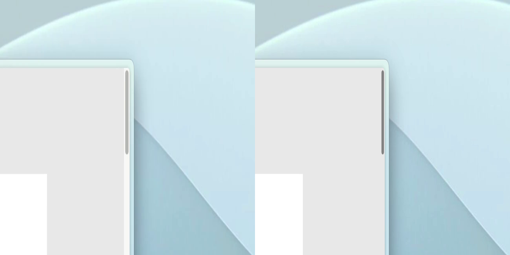

Há alguns dias, repostei um [tweet](https://x.com/raunofreiberg/status/2048057305439039535) com um pequeno trecho de código que deixa a barra de rolagem muito mais agradável visualmente (imagem tirada diretamente do tweet acima):



É claro que implementei isso no meu blog com uma única alteração: definindo a cor da barra de rolagem para seguir o token de cor do meu tema personalizado do Tailwind CSS:

```css [style.css]
@layer base {
  * {
    scrollbar-width: thin;
    scrollbar-color: var(--color-border) transparent; # --color-border é a variável CSS que contém a cor que eu quero para a minha barra de rolagem
  }
}
```

Vi no MDN que podem haver algumas preocupações de [acessibilidade](https://developer.mozilla.org/en-US/docs/Web/CSS/Reference/Properties/scrollbar-width) ao definir a barra de rolagem como fina. Se isso causar muita dificuldade para usar este blog, por favor, abra uma issue ou envie um PR no [repositório](https://github.com/DouglasdeMoura/douglasmoura.dev) do blog (afinal, ele é open source).
