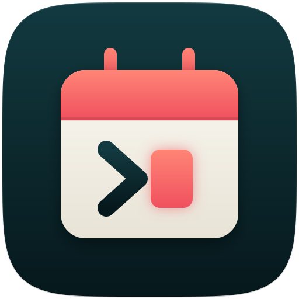

I have been building [chroncal](https://github.com/DouglasdeMoura/chroncal) over the past several months, and today I am opening it up. It is a terminal calendar, todo, and journal manager written in Go, backed by SQLite, with broad iCalendar (RFC 5545) import/export coverage and CalDAV sync. You get an interactive TUI for day-to-day use and a full CLI for scripting and automation. Your data lives in a single local file, portable and standards-compliant.

This is the tool I wanted for myself: something that feels like `lazygit` for calendars, works offline, talks to CalDAV servers (including Google Calendar), and stays out of the way when I just want to check my next meeting.

## What it does

chroncal covers three resource types that normally live in separate apps:

- **Events** (VEVENT) — scheduling with recurrence, timezones, attendees, alarms, and attachments
- **Todos** (VTODO) — task management with due dates, priority, progress tracking, and recurrence
- **Journals** (VJOURNAL) — daily notes and journal entries with recurrence support

All three support create, read, update, delete, search, and iCal import/export. All three sync over CalDAV. Soft-delete and restore are built in, so nothing is lost by accident.

## The TUI

Run `chroncal` with no arguments and you get an interactive terminal interface with month, week, day, and agenda views. Switch views with `m`, `w`, `d`, `a`. Calendars live in a sidebar with color coding. You can create, edit, view, and delete events without leaving the keyboard, and `u` undoes a delete.

CalDAV sync health is visible at a glance: a calendar whose last sync failed shows a warning icon in the sidebar, and opening it explains what went wrong and offers a fix. Remote calendars can be connected and re-authenticated directly from the TUI, including the Google OAuth flow.

The TUI ships two built-in themes. `system` is the default and resolves its UI colors from your terminal's 16-color ANSI palette, so themed setups like Catppuccin, Gruvbox, Tokyo Night, or Omarchy carry through to chroncal. It also adapts the selected-row highlight to the live terminal background when the terminal reports it. `default` uses a fixed light/dark designer palette if you prefer a consistent look across machines.

## The CLI

Every operation available in the TUI is also available as a CLI command, and the CLI goes further — full todo and journal management live here. This makes chroncal scriptable in ways that GUI calendar apps cannot match.

```bash
# Create a calendar
chroncal calendar create "Work" --color "#3B82F6"

# Add an event
chroncal event add "Team standup" --date 2026-04-01 --time 09:00 --duration 30m --calendar Work

# Add a recurring event
chroncal event add "Weekly review" --date 2026-04-04 --time 14:00 --duration 1h --rrule "FREQ=WEEKLY;BYDAY=FR"

# Add a todo
chroncal todo add "Write quarterly report" --due 2026-04-15 --priority 1

# Add a journal entry
chroncal journal add "Weekly notes" --date 2026-04-04 --calendar Work

# List upcoming events
chroncal event list --from 2026-04-01 --to 2026-04-30

# Search
chroncal event search "standup"
```

### JSON output for scripts and LLMs

Every command accepts `-o json` (or `--output json`). The output shape is stable, write commands return the new row so you can capture the `id` or `uid`, and errors go to stderr so piping through `jq` is always safe.

```bash
# Round-trip: create then read back the new event
uid=$(chroncal event add "Demo" --date 2026-06-01 --time 09:00 --output json | jq -r .uid)
chroncal event get "$uid" --output json
```

Timestamps in JSON are RFC 3339 UTC with a `Z` suffix, so cross-machine comparisons stay honest. Errors emit a JSON object on stderr with a `code` field (`not_found`, `invalid_input`, `aborted`, or `error`), so you can dispatch programmatically. This makes chroncal straightforward to drive from shell scripts, CI pipelines, or language model agents.

## CalDAV sync

Sync is per-calendar: each local calendar can be linked to a remote CalDAV URL. There is no separate account concept. Connect a calendar at create time:

```bash
chroncal calendar create "Work" \
    --remote-url https://cal.example.com/dav/calendars/work/ \
    --username alice --auth basic
```

Then sync and check status:

```bash
chroncal sync run --calendar Work
chroncal sync status
```

chroncal has been tested against Nextcloud CalDAV with VEVENT, VTODO, VJOURNAL, and VALARM round-tripping, including recurrence, timezone handling, and conflict resolution. Conflicts can be resolved with `--pick {local,server}`, and the default strategy is configurable.

### Google Calendar

Google Calendar requires OAuth 2.0 and only supports VEVENT over CalDAV. chroncal handles the full OAuth PKCE flow: you provide a Desktop app client ID and secret (the secret is accepted via environment variable or interactive prompt, never as a CLI flag), authorize once in the browser, and subsequent syncs run unattended. You can also connect and re-authenticate Google calendars directly from the TUI.

One important detail: you must enable both the Calendar JSON API and the CalDAV API on your Google Cloud project. The CalDAV endpoint returns `403 accessNotConfigured` until `caldav.googleapis.com` is enabled, even if the Calendar API is already on.

Credentials are kept separate from the calendar database. SQLite stores calendar data and remote metadata, but passwords, bearer tokens, OAuth refresh tokens, and Google client secrets go through the OS keyring by default. If a keyring is not available, chroncal refuses to store secrets unless you explicitly pass `--allow-plaintext`; that fallback writes `0600` JSON files under your chroncal config directory. It is useful for servers and containers, but backups and sync tools can still read those files, so I recommend using a real keyring on shared machines.

## Alarms and notifications

Alarms are first-class. Attach them when creating or updating events and todos with `--alarm`:

```bash
chroncal event add "Standup" --date 2026-06-15 --time 09:00 --alarm "-PT15M"
chroncal event add "Release" --date 2026-06-15 --time 14:00 --alarm "DISPLAY:-PT30M::3:PT5M"
```

The alarm syntax maps to RFC 5545 `VALARM`: `ACTION`, `TRIGGER`, `REPEAT`, `DURATION`, and `RELATED`. A bare `-PT15M` is a standard iCalendar duration trigger, meaning 15 minutes before the event or todo starts. The longer form is there when you need repeated alarms or an alarm relative to the end instead of the start.

DISPLAY alarms pop desktop notifications, AUDIO alarms play a sound, and EMAIL alarms send mail through a configured SMTP server. To actually fire alarms, either run `chroncal alarm daemon` in a foreground loop, or install a background service with `chroncal service install` — which sets up a systemd timer on Linux, launchd agent on macOS, or Scheduled Task on Windows. The installed service also runs CalDAV sync on a configurable interval (default 15 minutes).

## iCal compatibility

chroncal aims for complete RFC 5545 compliance. Current coverage includes VEVENT (30/31 properties), VTODO (31/32 properties), VJOURNAL, VALARM (7/7 properties plus RFC 9074 UID support), full ATTENDEE/ORGANIZER parameter coverage, VTIMEZONE round-trip preservation, and VFREEBUSY local compute plus remote CalDAV queries.

You can import from Google Calendar, Apple Calendar, Thunderbird, or any RFC 5545-compliant source, and export produces standards-compliant `.ics` files:

```bash
chroncal ical import calendar.ics --calendar Work
chroncal ical export --calendar Work -f work.ics
```

## Free/busy queries

Compute busy time from local recurring data, or query a remote CalDAV server:

```bash
chroncal freebusy --calendar Work --from 2026-04-01 --to 2026-04-30
chroncal freebusy --calendar Work --from 2026-04-01 --to 2026-04-30 --remote
```

## Installation

chroncal is available through eight installation channels covering Linux, macOS, and Windows:

| Method | Platforms |
| --- | --- |
| Install script | Linux, macOS, FreeBSD, OpenBSD |
| Homebrew | macOS, Linux |
| Go install | Any platform with Go 1.25+ |
| mise | macOS, Linux |
| Nix | Linux, macOS |
| Scoop | Windows |
| AUR | Arch Linux |
| Build from source | Any platform with Go 1.25+ |

The quickest path on Linux or macOS:

```bash
curl -fsSL https://raw.githubusercontent.com/DouglasdeMoura/chroncal/master/scripts/install.sh | sh
```

Or with Homebrew:

```bash
brew tap douglasdemoura/tap && brew install chroncal
```

On Windows, the managed install path is Scoop:

```powershell
scoop bucket add chroncal https://github.com/DouglasdeMoura/scoop-bucket
scoop install chroncal
```

Or if you use [mise](https://douglasmoura.dev/managing-your-development-environment-with-mise):

```bash
mise use -g github:DouglasdeMoura/chroncal
```

chroncal also has a custom app icon for launchers:

<p align="center">
  
</p>

If you use [Omarchy](https://omarchy.org/), you can add chroncal to the app menu with one command:

```bash
omarchy tui install chroncal chroncal float https://raw.githubusercontent.com/DouglasdeMoura/chroncal/master/assets/chroncal-512.png
```

That creates a launcher item that opens chroncal in your configured terminal. The `float` style opens it in a centered floating window; use `tile` if you want it to behave like a normal tiled window.

## Data storage

The database is a single SQLite file with WAL mode enabled for concurrency. Migrations run automatically on startup. Default locations:

- **Linux**: `~/.local/share/chroncal/chroncal.db`
- **macOS**: `~/Library/Application Support/chroncal/chroncal.db`

Override with `CHRONCAL_DB` or the `db` key in `config.toml`. Because it is a single file, backing up or moving your calendar data is a file copy.

## What is next

chroncal is at v0.3.x and MIT-licensed. The core feature set — events, todos, journals, CalDAV sync, alarms, iCal import/export, full-text search, and recurring rules — is working and tested. Todo and journal management in the TUI is the next major focus, along with `.deb` and `.rpm` packages.

If you live in the terminal and want your calendar data local, portable, and scriptable, give it a try. The repository is at [github.com/DouglasdeMoura/chroncal](https://github.com/DouglasdeMoura/chroncal), and issues and contributions are welcome.
